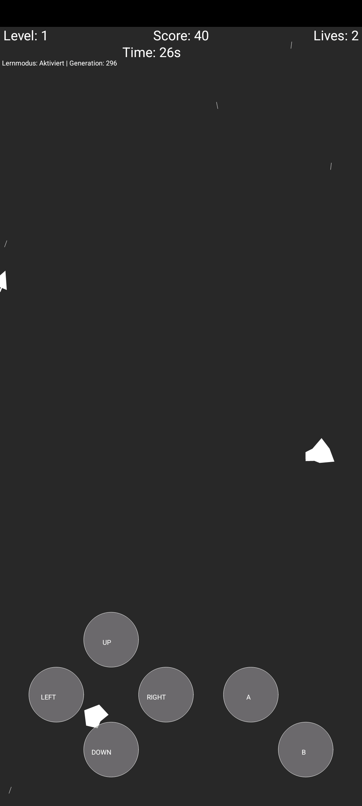

# 🚀 Asteroids AI – A Neural Network for Asteroids

## **Description**

This project implements an Asteroids game with an AI controlled by a neural network. The player can switch between manual mode and AI-controlled mode. The AI uses reinforcement learning to optimize its control.

The game is developed for **Android** using the **Processing APDE app** but can be easily ported to **PC** by replacing the touch commands with keyboard or mouse inputs.

[Game Screenshot](images/Screenshot_1_APDE Sketch Preview.jpg)
*Gameplay with AI learning enabled.*

*Neural network processing sensor data in real-time.*

## **Features**

- **Neural network** with a flexible architecture (input, hidden, and output layers).
- **Reinforcement learning mechanism** with adjustable learning rate, future weighting, and exploration rate.
- **Multiple sensors** to detect obstacles and movement.
- **Statistics & visualizations** to track learning progress.
- **Customizable network structure** for experimenting with different AI approaches.

## **Installation & Requirements**

### Prerequisites:

- **Processing** (Java-based development environment)
- **APDE** (Android Processing Development Environment) for running on Android
- Standard libraries for vectors and arrays

### Installation:

1. **Install Processing**: [https://processing.org/download](https://processing.org/download)
2. **For Android:** Install **APDE** from the Google Play Store
3. **Download and open the project files**
4. **Start the game** by running the `GameCode.pde` file

## **Usage**

1. **Select game mode**:
   - `learningMode = false;` → Player controls the spaceship
   - `learningMode = true;` → AI takes over control
2. **Adjust parameters** (learning rate, neural layers, sensor data, etc.)
3. **Start the game** and observe how the AI improves 🚀

## **Porting to PC**

To run this game on a **PC**, replace the **touch commands** with equivalent **keyboard or mouse inputs** in the Processing sketch.

## **Neural Network Parameters**

- `alpha` → Learning rate (how quickly the network learns)
- `gamma` → Future weighting (importance of future rewards)
- `epsilon` → Exploration rate (percentage of random actions)
- `numSensors` → Number of sensors for environment perception
- `networkDepth` → Number of hidden layers in the network
- `hiddenNodes` → Number of neurons per hidden layer
- `outputNodes` → Number of output neurons for control decisions

## **Further Development & Customization**

- Adjust **neural network architecture**
- Experiment with different **learning strategies**
- Optimize **sensor data processing**
- Improve **AI strategy using evolution or deep Q-learning**

## **License**

This project is licensed under the **MIT License**. Free to use, modify, and distribute.

---

Have fun experimenting with AI-powered spaceships! 🚀😃
