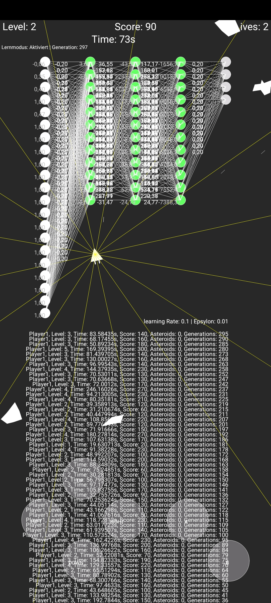
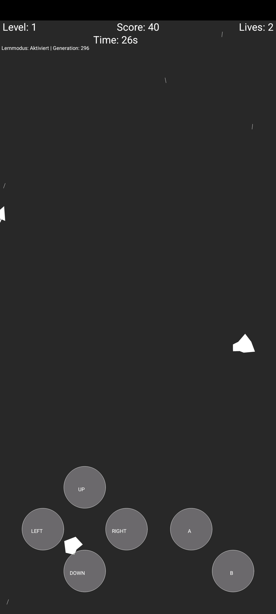

# 🚀 Asteroids AI – A Neural Network for Asteroids

## **Description**

This project implements an Asteroids game with an AI controlled by a neural network. The player can switch between manual mode and AI-controlled mode. The AI uses reinforcement learning to optimize its control.

*Gameplay with AI learning enabled.*

*Neural network processing sensor data in real-time.*

## **Features**

- **Neural network** with a flexible architecture (input, hidden, and output layers).
- **Reinforcement learning mechanism** with adjustable learning rate, future weighting, and exploration rate.
- **Multiple sensors** to detect obstacles and movement.
- **Statistics & visualizations** to track learning progress.
- **Customizable network structure** for experimenting with different AI approaches.

## **Installation & Requirements**

### Prerequisites:

- [Processing IDE](https://processing.org/download) (Java-based development environment)
- [APDE (Android Processing Development Environment)](https://github.com/Calsign/APDE) if running on Android
- Standard libraries for vectors and arrays

### Installation:

1. **Install Processing** (or APDE for Android)
2. **Download and open the project files**
3. **Start the game** by running `GameCode.pde`

## **Usage**

1. **Select game mode**:
   - `learningMode = false;` → Player controls the spaceship
   - `learningMode = true;` → AI takes over control
2. **Adjust parameters** (learning rate, neural layers, sensor data, etc.)
3. **Start the game** and observe how the AI improves 🚀

## **Porting to PC**

This game is originally developed for Android using APDE but can easily be ported to PC by replacing **touch input commands** with **keyboard controls** in `GameCode.pde`.

## **License**

This project is licensed under the MIT License. Free to use, modify, and distribute.

---

Have fun experimenting with AI-powered spaceships! 🚀😃
